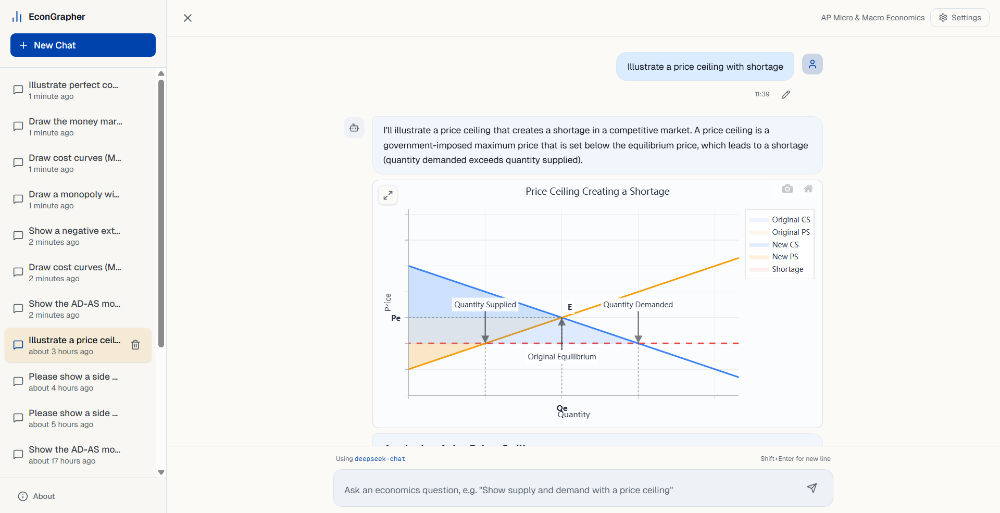

<div align="center">


# EconGrapher

**Graphing AI Economics Assistant**

*Your intelligent companion for economic visualization*

[](https://nextjs.org/)
[](https://reactjs.org/)
[](https://www.typescriptlang.org/)
[](LICENSE)

[🚀 Quick Start](#-quick-start) · [✨ Features](#-features) · [📖 Documentation](#-architecture) · [🤝 Contributing](#-contributing)

***

</div>

## 📸 Screenshot

<div align="center">



*Interactive economics graphs with AI-powered assistance*

</div>

## 🎯 Overview

EconGrapher is an AI economics assistant designed for **AP Micro & Macro Economics**. Ask questions, explore concepts, and generate interactive graphs through natural language conversations.

## ✨ Features

<table>
<tr>
<td width="50%">

### 🤖 AI Generation

- Natural language input
- Real-time streaming responses
- Thinking process visibility
- Multi-provider support

</td>
<td width="50%">

### 📐 Geometric Primitives

- Semantic chart definitions
- Auto-calculated coordinates
- Intersection detection
- Projection handling

</td>
</tr>
<tr>
<td width="50%">

### 📊 Interactive Charts

- Zoom & pan capabilities
- Export to multiple formats
- Responsive design
- Plotly.js powered

</td>
<td width="50%">

### 💾 Session Management

- Local conversation storage
- Multiple sessions support
- Chat history preservation
- Quick session switching

</td>
</tr>
</table>

## 📚 Supported Charts

<details>
<summary><b>🔬 Microeconomics</b></summary>

| Chart Type                | Description                     |
| ------------------------- | ------------------------------- |
| Supply & Demand           | Market equilibrium analysis     |
| Consumer/Producer Surplus | Welfare analysis                |
| Price Controls            | Ceilings and floors             |
| Elasticity                | Price, income, cross elasticity |
| Cost Curves               | MC, ATC, AVC, AFC               |
| Market Structures         | Perfect competition, monopoly   |
| Factor Markets            | Labor, capital markets          |

</details>

<details>
<summary><b>🌍 Macroeconomics</b></summary>

| Chart Type     | Description               |
| -------------- | ------------------------- |
| AD-AS Model    | Aggregate demand & supply |
| Phillips Curve | Inflation-unemployment    |
| Money Market   | Supply & demand for money |
| Loanable Funds | Investment & savings      |
| Forex Market   | Exchange rate dynamics    |
| PPC            | Production possibilities  |

</details>

## 🚀 Quick Start

### Prerequisites

```bash
node >= 18.0.0
npm or pnpm
```

### Installation

```bash
# Clone the repository
git clone https://github.com/ItsTimeTooSleep/EconGrapher.git
cd EconGrapher

# Install dependencies
npm install

# Start development server
npm run dev
```

### Configuration

<div align="center">

| Step | Action                                 |
| :--: | -------------------------------------- |
|  1️⃣ | Open the application in your browser   |
|  2️⃣ | Click **"Set API Key"** in the header  |
|  3️⃣ | Enter your API key and select provider |
|  4️⃣ | Start chatting with your AI assistant  |

</div>

### Supported AI Providers

| Provider                                                                                     | Endpoint                            | Models            |
| -------------------------------------------------------------------------------------------- | ----------------------------------- | ----------------- |
|  | `api.openai.com/v1`                 | GPT-4, GPT-4o     |
|         | `api.anthropic.com/v1`              | Claude 3.5 Sonnet |
|  | `generativelanguage.googleapis.com` | Gemini Pro        |
| Custom                                                                                       | *Any OpenAI-compatible*             | *Varies*          |

## 🎮 Usage

### Basic Commands

```bash
/export [format]    # Export conversation (json/md/html)
/debug              # Export raw API request data
```

### Example Workflow

```
👤 User: Draw a monopoly market showing deadweight loss

🤖 AI: I'll create a monopoly diagram showing:
      • Demand curve (D)
      • Marginal Revenue (MR) 
      • Marginal Cost (MC)
      • Deadweight loss area
      
      [📊 Interactive Chart Generated]
      
      The monopoly produces where MR = MC, charges 
      price Pm, creating deadweight loss shown in red...
```

## 🏗 Architecture

### Geometric Primitive System

<div align="center">

```
┌──────────────────┐     ┌──────────────────┐     ┌──────────────────┐
│   AI describes   │ ──► │  System computes │ ──► │  Chart renders   │
│   semantically   │     │   coordinates    │     │   interactively  │
└──────────────────┘     └──────────────────┘     └──────────────────┘
        │                        │                        │
        ▼                        ▼                        ▼
   "intersection"          (x: 5, y: 7)            Plotly.js trace
   "projection"            Calculated               visualization
   "area"                  automatically
```

</div>

### Chart Definition Example

```json
{
  "title": "Market Equilibrium",
  "curves": [
    { "id": "D", "label": "D", "type": "linear", "slope": -1, "intercept": 10 },
    { "id": "S", "label": "S", "type": "linear", "slope": 1, "intercept": 2 }
  ],
  "points": [
    { "id": "E", "definition": { "type": "intersection", "curve1": "D", "curve2": "S" } }
  ],
  "lines": [
    { "definition": { "type": "dashedToAxis", "from": "E", "xLabel": "Qe", "yLabel": "Pe" } }
  ],
  "areas": [
    { "points": ["D_int", "Pe", "E"], "color": "rgba(59, 130, 246, 0.3)", "label": "CS" }
  ]
}
```

### Project Structure

```
EconGrapher/
├── 📁 app/                      # Next.js App Router
│   ├── page.tsx                 # Main application page
│   ├── layout.tsx               # Root layout
│   └── globals.css              # Global styles
│
├── 📁 components/
│   ├── 📁 charts/               # Chart components
│   │   ├── EconChart.tsx        # Main chart renderer
│   │   ├── SingleChart.tsx      # Single chart wrapper
│   │   └── 📁 builders/         # Chart builders
│   │
│   └── 📁 ui/                   # UI components (Radix)
│       ├── button.tsx
│       ├── dialog.tsx
│       └── ...
│
├── 📁 lib/
│   ├── ai-service.ts            # AI provider integration
│   ├── storage.ts               # LocalStorage management
│   │
│   └── 📁 rule-engine/          # Geometric primitive engine
│       ├── 📁 curve-templates/  # Curve generation
│       └── 📁 primitives/       # Point, line, area
│
├── 📁 docs/                     # Documentation
│   └── ai-chart-api-reference.md
│
└── 📁 types/                    # TypeScript definitions
```

## 🛠 Development

### Scripts

| Command         | Description              |
| --------------- | ------------------------ |
| `npm run dev`   | Start development server |
| `npm run build` | Build for production     |
| `npm run start` | Start production server  |
| `npm run lint`  | Run ESLint               |

### Tech Stack

<div align="center">

[](https://nextjs.org/)
[](https://reactjs.org/)
[](https://www.typescriptlang.org/)
[](https://tailwindcss.com/)
[](https://plotly.com/javascript/)
[](https://www.radix-ui.com/)

</div>

## 🤝 Contributing

Contributions are welcome! Here's how you can help:

1. 🍴 Fork the repository
2. 🌿 Create your feature branch (`git checkout -b feature/amazing-feature`)
3. 💾 Commit your changes (`git commit -m 'Add amazing feature'`)
4. 📤 Push to the branch (`git push origin feature/amazing-feature`)
5. 🎉 Open a Pull Request

## 📄 License

This project is licensed under the **MIT License** - see the [LICENSE](LICENSE) file for details.

## 🙏 Acknowledgments

<div align="center">

| Project                                     | Description                        |
| ------------------------------------------- | ---------------------------------- |
| [Next.js](https://nextjs.org/)              | The React Framework for Production |
| [Radix UI](https://www.radix-ui.com/)       | Unstyled, accessible UI components |
| [Plotly.js](https://plotly.com/javascript/) | Open-source graphing library       |
| [Tailwind CSS](https://tailwindcss.com/)    | Utility-first CSS framework        |

</div>

***

<div align="center">

**Made with ❤️ for economics education**

[⬆ Back to Top](#-econgrapher)

</div>
